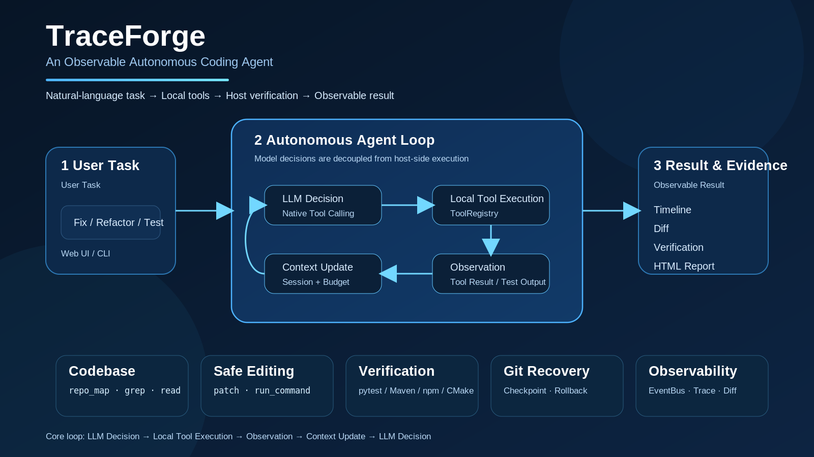

# TraceForge

<p align="center">
  <strong>Observe every step. Forge correct code.</strong><br>
  <em>An Observable Autonomous Coding Agent</em>
</p>

<p align="center">
  
</p>

TraceForge 是一个从零实现、在本地工作区运行的轻量级 **Autonomous Coding Agent**。用户只需选择代码目录并输入自然语言编程任务，Agent 即可自主理解代码库、调用本地工具、修改文件、运行测试，并根据真实验证结果继续修复。任务最终失败时可自动回滚；成功任务完成后，也可以从 Web UI 将本次修改安全恢复到任务开始前的 Git Checkpoint。

项目没有使用 LangChain、LlamaIndex、AutoGen、CrewAI、OpenAI Agents SDK、Claude Agent SDK 等 Agent 框架，也不依赖 API 服务端托管的文件或代码执行能力。**Agent Loop、上下文管理、Tool Calling、本地执行、输出解析、终止策略、错误处理、验证和回滚均由项目自行实现。**

## 1. 设计目标

TraceForge 聚焦 Coding Agent 的核心工程闭环：

- **自主执行**：通过 `LLM Decision → Local Tool Execution → Observation → Context Update → LLM Decision` 持续推进任务；
- **代码库理解**：使用 Repo Map、Glob、Grep 与分页读取建立代码上下文；
- **安全修改**：文件路径受 Workspace Sandbox 约束，写操作与命令执行受宿主权限策略控制；
- **独立验证**：代码发生修改后，由宿主程序选择测试命令进行再次验证，不以模型自述作为完成依据；
- **失败与人工恢复**：在安全 Git 基线上建立 Checkpoint；任务最终失败时自动回滚，成功任务也可在 Web UI 中显式撤销本次 Agent 修改；
- **全过程可观测**：记录 Timeline、Tool Call、Diff、Verification，并可生成 JSONL Trace 与 HTML Report。

## 2. 系统工作流程

```text
用户自然语言任务
       │
       ▼
   CodingAgent
       │
       ▼
    AgentLoop ───────────────► Session / ContextManager
       │                              │
       │                              └─ 完整历史持久化 + 输入窗口预算控制
       │
       ├── LLMClient ─────────► OpenAI-compatible Tool Calling
       │
       ├── ToolRegistry ──────► 代码搜索 / 文件读写 / Patch / 命令执行
       │
       ├── Verifier ──────────► pytest / Maven / Gradle / npm / CMake
       │
       └── GitCheckpoint ─────► Checkpoint / Rollback
       │
       ▼
     EventBus ────────────────► Web UI / JSONL Trace / Diff / HTML Report
```

模型只负责决定“下一步做什么”；路径边界、权限校验、工具实际执行、自动验证、Git 回滚与 Web 手动恢复均由本地宿主程序负责。该设计将模型决策与执行安全分离，使 Agent 的行为可检查、结果可验证、失败可恢复，并允许用户显式撤销一次成功任务造成的工作区修改。

## 3. 代码结构

```text
TraceForge/
├── main.py                       # 一键验收入口：框架测试、Demo、Agent、最终验证与报告
├── web_main.py                   # Web UI 启动入口
├── cli.py                        # CLI / 单次任务 / Web Console 入口
├── traceforge/
│   ├── agent/
│   │   ├── agent.py              # CodingAgent 对外接口，持有长期 Session
│   │   ├── loop.py               # 核心 Agent Loop、终止条件、验证重试与失败回滚
│   │   └── context.py            # 模型输入窗口、预算控制与 Tool Call 原子块保留
│   ├── llm/
│   │   ├── client.py             # OpenAI-compatible 模型客户端及厂商参数适配
│   │   ├── parser.py             # 模型文本与 Tool Call 的统一解析
│   │   └── messages.py           # LLM 响应数据结构
│   ├── tools/
│   │   ├── registry.py           # Tool Schema 注册、权限检查与统一调度
│   │   ├── file_tools/           # 目录、分页读文件、写文件与精确替换
│   │   ├── command_tools/        # 本地命令执行、超时与危险命令策略
│   │   └── schemas/              # 暴露给模型的 Tool Calling Schema
│   ├── codebase/                 # repo_map、glob、grep、符号提取
│   ├── edit/                     # 带预期文本校验的结构化 apply_patch
│   ├── workspace/                # 工作区路径解析与越界防护
│   ├── policy/                   # PLAN / AUTO / CONFIRM 宿主权限模式
│   ├── context/                  # 字符预算估算与确定性历史摘要
│   ├── session/                  # 完整多轮会话与 JSONL 持久化
│   ├── verification/             # 项目类型检测与宿主侧自动验证
│   ├── git/                      # Git Checkpoint 与 Rollback
│   ├── events/                   # 生命周期事件、EventBus 与内存事件存储
│   ├── observability/            # JSONL Trace 与代码 Diff
│   ├── web/                      # 本地 Web Server、运行状态、手动恢复和前端资源
│   ├── demo/                     # 可重复 Demo、快照、Git 基线与 HTML 报告
│   ├── config/                   # .env、环境变量与运行参数
│   ├── prompts/                  # Agent System Prompt
│   └── bootstrap.py              # 运行时组件组装
├── tests/                        # 核心模块单元测试与回归测试
├── demo_template*/               # Feature / Debug / Rollback 可重复场景
└── docs/images/                  # README 架构图
```

### 核心模块关系

`bootstrap.py` 负责组装 Workspace、Session、ToolRegistry、Verifier、GitCheckpointManager、EventBus 与 CodingAgent。`CodingAgent` 将单次任务交给 `AgentLoop`；`AgentLoop` 调用 `LLMClient` 获得模型决策，通过 `ToolRegistry` 在本地执行工具，并把真实观察结果写回 Session 后继续下一轮模型调用。

Session 始终保留完整历史；`ContextManager` 只构造发送给模型的输入窗口。当单个长任务产生大量文件内容或测试日志时，它会在字符预算内保留最近执行步骤，并把 **assistant tool_calls 与对应 tool results 作为不可拆分原子块**，较旧内容由本地 `ContextCondenser` 做确定性摘要，因此不会因为压缩产生孤立的 Tool Result。

## 4. 题目关键逻辑对应实现

| 关键逻辑 | TraceForge 实现位置 |
|---|---|
| 对话历史与上下文管理 | `traceforge/session/`、`traceforge/agent/context.py`、`traceforge/context/` |
| Tool 定义与本地执行 | `traceforge/tools/`、`traceforge/workspace/`、`traceforge/policy/` |
| 模型输出与 Tool Call 解析 | `traceforge/llm/parser.py`、`traceforge/llm/messages.py` |
| Agent 循环与终止条件 | `traceforge/agent/loop.py` |
| 错误处理与结构化工具结果 | `traceforge/exceptions/`、`traceforge/tools/result.py` |
| 自动验证 | `traceforge/verification/` |
| 失败恢复与安全手动恢复 | `traceforge/git/checkpoint.py`、`traceforge/web/state.py` |
| 可观测性 | `traceforge/events/`、`traceforge/observability/`、`traceforge/web/` |

## 5. 主要能力

### 自主 Agent Loop
支持多轮原生 Tool Calling、最大执行步数、宿主验证失败后的继续修复，以及达到常规工具步数上限后的单次无工具收尾。Agent 不依赖预定义动作序列，而是根据当前上下文和真实工具结果动态选择下一步。

### 代码库理解
提供 `repo_map`、`glob_files`、`grep_search` 与分页 `read_file`。Repo Map 会提取目录和关键符号，使模型能够先建立代码库全局认识，再有针对性地读取实现。

### 安全工具执行
支持 `list_directory`、`read_file`、`write_file`、`replace_in_file`、`apply_patch` 与 `run_command`。所有文件路径限制在当前 Workspace 内；命令执行经过宿主策略检查、超时控制，并统一返回 Never-Throw `ToolResult`。

### 上下文与会话管理
Session 保存完整历史并可持久化到 JSONL；Context Manager 同时限制历史轮次数量和输入字符预算。对于一次任务内部连续产生的大量 Tool Result，会按原子执行块保留最近观察并压缩较早步骤，控制模型输入规模。

### 自动验证、失败回滚与手动恢复
代码修改后，宿主程序可自动检测并执行 `pytest`、Maven、Gradle、npm 或 CMake 等验证命令。失败结果会重新反馈给 Agent；若任务最终失败且存在安全 Checkpoint，则自动回滚到任务开始前的 Git 基线。

对于已经成功完成的任务，Web UI 还提供 **“恢复本次修改”** 操作。TraceForge 会在任务结束时记录工作树指纹；只有当工作区从任务结束后没有发生新的人工修改时，才允许恢复到任务开始前的 Checkpoint。若检测到新的变更则拒绝恢复，避免覆盖用户后续工作。恢复成功后会同步清除旧会话，防止下一轮模型继续依赖已经撤销的代码状态。

### 可观测 Web UI
Web UI 支持选择本地 Workspace、输入任意自然语言编程任务，并实时展示 Agent Timeline、工具调用与结果、文件 Diff、验证状态、执行步数和最终总结。成功任务产生可恢复修改时，`CODE CHANGES` 区域会启用“恢复本次修改”按钮，并把手动恢复过程作为事件继续记录到 Timeline。

## 6. 快速开始

### 安装依赖

```bash
pip install -r requirements.txt
```

建议使用 Python 3.10+。

### 配置模型

复制 `.env.example` 为 `.env`，填写自己的模型配置：

```text
TRACEFORGE_API_KEY=your_api_key
TRACEFORGE_MODEL=your_model
TRACEFORGE_BASE_URL=your_openai_compatible_base_url
TRACEFORGE_AGENT_MODE=auto
```

已有系统环境变量优先于 `.env`。`.env` 已加入 `.gitignore`，真实 API Key 不应提交到仓库或演示材料。

### 启动 Web UI

```bash
python web_main.py
```

浏览器访问 `http://127.0.0.1:8765`。Windows 也可运行 `start_web.bat`。

### CLI 运行

```bash
python cli.py <workspace> "请检查当前项目并修复失败测试"
```

CLI、Web UI 和一键 Demo 均支持从项目根目录 `.env` 读取模型配置。

### 一键运行 Demo

```bash
python main.py
```

默认运行 `order_total_bug`：框架测试 → 重建 Demo Workspace → 确认失败基线 → 建立 Git Checkpoint → Agent 跨模块定位 Bug → 最小修改 → 宿主最终验证 → 生成 Diff、Trace 与 HTML Report。

### 运行框架测试

```bash
python -m pytest -q
```

## 7. 内置演示场景

| 场景 | 目标 |
|---|---|
| `power_function` | 新增功能并补充单元测试 |
| `discount_bug` | 根据失败测试定位并修复单文件缺陷 |
| `order_total_bug` | 分析跨模块调用关系并完成最小修复（默认） |
| `rollback_recovery` | 在受控最终失败后验证 Git 自动回滚 |

`order_total_bug` 能完整展示“失败测试 → 代码库理解 → 多文件分析 → 最小修改 → 再次测试 → Host Verification”的自主 Coding Agent 工作闭环；`rollback_recovery` 用于独立展示失败恢复机制。

## 8. 实现说明

TraceForge 刻意保持单 Agent、少依赖和可解释的工程结构。核心执行逻辑全部位于本地 Python 代码中，模型服务仅提供语言模型推理与原生 Tool Calling 能力；文件系统访问、命令执行、测试验证和 Git 操作均由 TraceForge 自行实现。

## Repository

https://github.com/gaod-at-suda/TraceForge
